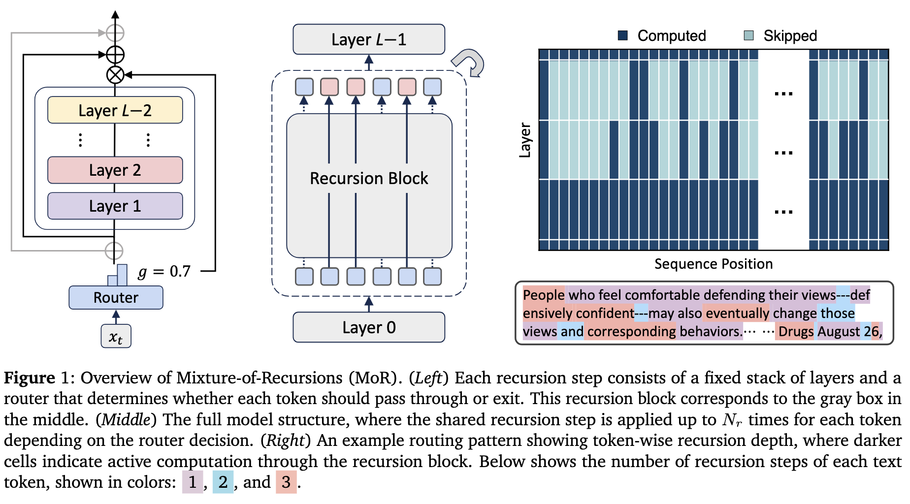

# Mixture-of-Recursions: Learning Dynamic Recursive Depths for Adaptive Token-Level Computation

<a href="https://arxiv.org/abs/2507.10524"></a>
<a href=#bibtex></a>

**Sangmin Bae<sup>1\*</sup> &nbsp; Yujin Kim<sup>1\*</sup> &nbsp; Reza Bayat<sup>2\*</sup> &nbsp; Sungnyun Kim<sup>1</sup> &nbsp; Jiyoun Ha<sup>3</sup> &nbsp; Tal Schuster<sup>4</sup> &nbsp; Adam Fisch<sup>4</sup>  &nbsp; Hrayr Harutyunyan<sup>5</sup>  &nbsp; Ziwei Ji<sup>4</sup> &nbsp; Aaron Courville<sup>2,6&ddagger;</sup> &nbsp; Se-Young Yun<sup>1&ddagger;</sup>**.  
<sup>**1**</sup>KAIST AI &nbsp; <sup>**2**</sup>Mila &nbsp; <sup>**3**</sup>Google Cloud &nbsp;  <sup>**4**</sup>Google DeepMind &nbsp; <sup>**5**</sup>Google Research &nbsp; <sup>**6**</sup>Université de Montréal    
\*Equal contribution. &nbsp; &ddagger;Corresponding authors.

<p align="left">

</p>


## 🔥 Research Motivation

**Early-exiting [[CALM](https://arxiv.org/abs/2207.07061)]**, an Adaptive Computation technique, helps LLMs run more efficiently by allowing them to skip unnecessary computations when they're confident in their predictions. This creates dynamic pathways through the model. However, putting early-exiting into practice faces **two main bottlenecks**:
1.  **Missing Key-Value (KV) cache problem:** 
    When tokens exit early, they skip computing the KV pairs for remained deeper layers. But these missing values are essential for decoding future tokens, and trying to approximate them often hurts performance.   

2.  **Inefficient batched inference:** 
    Tokens that exit early end up waiting for others in the same batch to finish their full computation. This "idling" prevents efficient batching and wastes processing time.
    
Previous work tackled these challenges individually:

*  **[FREE Framework](https://arxiv.org/abs/2310.05424)** 
    addressed the missing KV cache problem using **parallel decoding** (an early form of self-speculative decoding), which efficiently computes the exact KV pairs for early-exited tokens. However, compatibility with batch inference remained poor.

*  **[Recursive Transformers](https://arxiv.org/abs/2410.20672)** 
    aimed to mitigate inefficient batched inference through **parameter sharing**, enabling tokens at different depths to be processed together. Yet, two separate training processes for integrating parameter sharing and early-exiting degraded performance, and this model still required handling the missing KV cache.


Our new research **[[MoR](https://arxiv.org/abs/2507.10524)]** introduces a **unified framework** that directly tackles both the missing KV cache and batched inference issues. We achieve this with a ✨ **routing mechanism** trained end-to-end effectively, which dynamically assigns the optimal recursion depth to each token. We further enhance this by introducing a ✨ **recursion-wise KV caching strategy** that selectively stores KV pairs, resolving the missing cache problem while optimizing memory usage.
We achieve up to **2× higher inference throughput** compared to standard transformers at similar accuracy, while also reducing total training FLOPs and memory requirements.


## 🏃 Environment Setup

To get started, follow these steps to set up your development environment. We recommend using `conda` for dependency management.

1.  **Create and Activate Conda Environment:**
    ```bash
    conda create -n mor python=3.12
    conda activate mor
    ```

2.  **Install Required Packages:**
    First, ensure your `pip` and `setuptools` are up to date. Then, install `torch` and the dependencies listed in [requirements.txt](https://github.com/raymin0223/mixture_of_recursions/tree/main/requirements.txt).

    **Note:** We specifically used `torch==2.6.0+cu124`, `flash_attn==2.7.4.post1`, and `transformers==4.50.0`. If you encounter issues, consider these exact versions.

    ```bash
    pip install --upgrade pip
    pip install --upgrade setuptools
    pip install torch
    pip install -r requirements.txt
    # If you experience issues with flash-attn, try:
    # pip install flash-attn --no-build-isolation
    ```


## 📚 Dataset Download

Our models are pretrained on a deduplicated subset of the **FineWeb-Edu** dataset, available as part of the [SmolLM-Corpus](https://huggingface.co/datasets/HuggingFaceTB/smollm-corpus).

Follow these steps to download and prepare the dataset:

1.  **Create Data Directories:**
    Create the necessary directories (`hf_cache`, `hf_datasets`, `hf_models`, and `results`) under your designated data path. Replace `{your_data_path}` with your actual path.

    ```bash
    mkdir -p {your_data_path}/mixture-of-recursions/hf_cache
    mkdir -p {your_data_path}/mixture-of-recursions/hf_datasets
    mkdir -p {your_data_path}/mixture-of-recursions/hf_models
    mkdir -p {your_data_path}/mixture-of-recursions/results
    ```

2.  **Create Symbolic Links:**
    Establish symbolic links from your data path to your project's current path. Replace `{your_data_path}` and `{your_project_path}` accordingly.

    ```bash
    ln -s {your_data_path}/mixture-of-recursions/* {your_project_path}/mixture-of-recursions/
    ```

3.  **Download Pretraining Corpus:**
    Execute the provided script to download the `fineweb-edu-dedup` dataset.

    ```bash
    bash lm_dataset/download_pretraining_corpus.sh
    ```


## 🔎 Implementation Overview

### 👉 Dataset and Data Handling

For details on the dataset used, please refer to the [lm_dataset](https://github.com/raymin0223/mixture_of_recursions/tree/main/lm_dataset) directory. We used our custom language modeling dataset class for this project. There are opportunities for optimization:
1. Improving the loading speed of the data `state_dict` when restarting interrupted training. 
2. Additionally, our current input packing allows for attention across different documents, which could be mitigated by integrating future advancements like [FlexAttention](https://pytorch.org/blog/flexattention/).


### 👉 MoR Architecture

Our models are built upon the Llama architecture, specifically by modifying the [LlamaForCausalLM](https://github.com/huggingface/transformers/blob/v4.53.2/src/transformers/models/llama/modeling_llama.py#L475-L581) class.
The Expert-choice and Token-choice versions of our MoR architecture can be found in [expert_choice_router.py](https://github.com/raymin0223/mixture_of_recursions/tree/main/model/mor_model/expert_choice_router.py) and [token_choice_router.py](https://github.com/raymin0223/mixture_of_recursions/tree/main/model/mor_model/token_choice_router.py), respectively. 

The high-level routing process follows these steps:

1.  **Obtain Indices:**
    Get indices from the top-k selections of the routers.

2.  **Index Tokens:**
    Index the current tokens using these obtained indices. For expert-choice, we can avoid variable-length complexities since all samples have the same length. However, for token-choice, we handle variable lengths by adding padding using `rnn_utils.pad_sequence`.

3.  **Compute Shared Blocks:** 
    Perform computations on the shared blocks once.

4.  **Scatter and Combine:**
    `scatter_add` the computed tokens back to their original shape using the previously obtained indices.

5.  **Repeat:**
    Repeat this process for the desired number of recursions.

**Note:**  We believe further optimizations are possible through the use of `FlexAttention` and `grouped_mm`. 
Moreover in case of KV sharing, we computed all sequences against a shared KV cache for simplicity. The outputs for tokens participating in a specific recursion were then extracted by masking.

## 🚆 Training and Evaluation

### 👉 Configuration Generation

To streamline the creation of training and evaluation scripts, we made an automated Python utility: [generate_pretrain_eval_fewshot_configs.py](https://github.com/raymin0223/mixture_of_recursions/tree/main/util/generate_pretrain_eval_fewshot_configs.py). This script will generate configurations based on `example.yaml` files located under [conf/pretrain](https://github.com/raymin0223/mixture_of_recursions/tree/main/conf/pretrain) or [conf/eval_fewshot](https://github.com/raymin0223/mixture_of_recursions/tree/main/conf/eval_fewshot). By specifying your custom config name and providing arguments, the script will automatically generate a YAML file for your configuration.

To generate a configuration, simply run:

```bash
python util/generate_pretrain_eval_fewshot_configs --name {config_name}
# Example: python util/generate_pretrain_eval_fewshot_configs --name 250720_pretrain_smollm-360m_rec3_middle_cycle_random_lr3e-3_mor_expert_linear_alpha_0.1_sigmoid_aux_loss_0.001
```


### 👉 Training Setup

We typically conducted training using 4 H100 or A100 GPUs. For distributed training, we leveraged either `Accelerate` or `DeepSpeed` ZeRO Stage 2. Exploring FSDP, Tensor Parallelism, and Pipeline Parallelism for MoR models is left for future work.


Here are the training commands for both versions:


```bash
# DeepSpeed
HYDRA_FULL_ERROR=1 deepspeed --include localhost:0,1,2,3 --no_local_rank --master_port 25720 pretrain.py --config-name example

# Accelerate
HYDRA_FULL_ERROR=1 CUDA_VISIBLE_DEVICES=0,1,2,3 accelerate launch --config_file acc_configs/default_config.yaml --main_process_port 25720 pretrain.py --config-name example
```


### 👉 Evaluation

Few-shot accuracy was measured using [lm-evaluation-harness](https://github.com/EleutherAI/lm-evaluation-harness).

Here are the evaluation commands:

```bash
# DeepSpeed
HYDRA_FULL_ERROR=1 deepspeed --include localhost:0,1,2,3 --no_local_rank --master_port 23393 eval_fewshot.py --config-name example

# Accelerate
HYDRA_FULL_ERROR=1 CUDA_VISIBLE_DEVICES=0,1,2,3 accelerate launch --config_file acc_configs/default_config.yaml --main_process_port 23393 eval_fewshot.py --config-name example
```

You can also evaluate the validation loss using [evaluate_fineweb_test.py](https://github.com/raymin0223/mixture_of_recursions/tree/main/evaluate_fineweb_test.py). We specifically measure validation loss for scaling laws analysis.


### 👉 Combined Training and Evaluation

To run training and few-shot evaluation concurrently with a single command, execute the following shell script:
```bash
bash scripts/pretrain_eval_fewshot.sh {launcher} {wandb_mode} {gpu_indices} {exp1_config} {exp2_config} ...
# Example: bash scripts/pretrain_eval_fewshot.sh deepspeed online 0,1,2,3 250720_pretrain_smollm-360m_rec3_middle_cycle_random_lr3e-3_mor_expert_linear_alpha_0.1_sigmoid_aux_loss_0.001
```


## 🙏 BibTeX

If you find our work useful, please cite it as:

```
@misc{bae2025mixtureofrecursionslearningdynamicrecursive,
    title={Mixture-of-Recursions: Learning Dynamic Recursive Depths for Adaptive Token-Level Computation}, 
    author={Sangmin Bae and Yujin Kim and Reza Bayat and Sungnyun Kim and Jiyoun Ha and Tal Schuster and Adam Fisch and Hrayr Harutyunyan and Ziwei Ji and Aaron Courville and Se-Young Yun},
    year={2025},
    eprint={2507.10524},
    archivePrefix={arXiv},
    primaryClass={cs.CL},
    url={https://arxiv.org/abs/2507.10524}, 
}
```